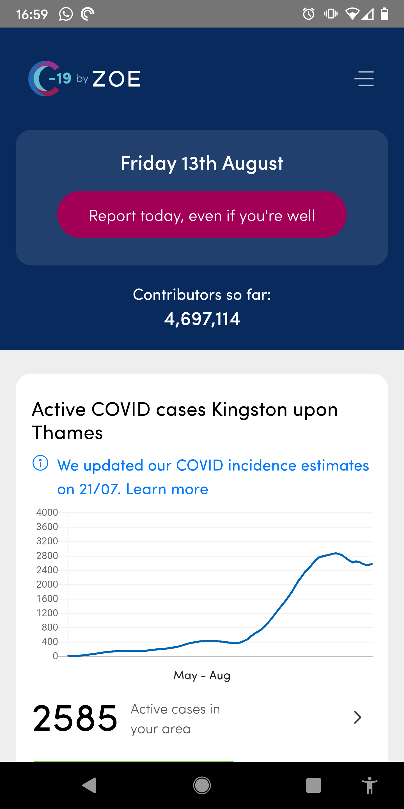
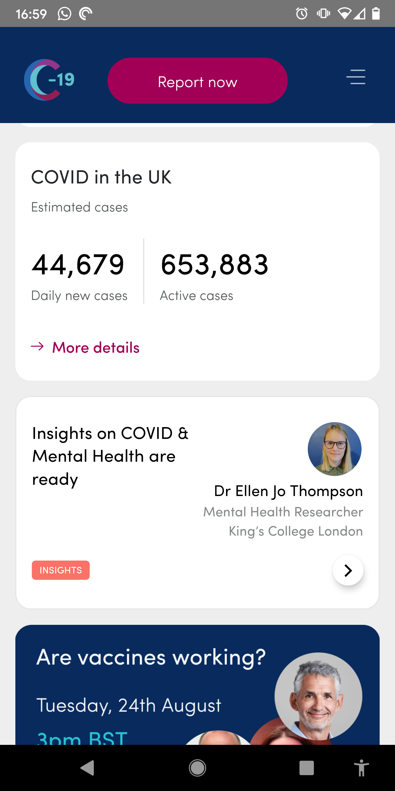
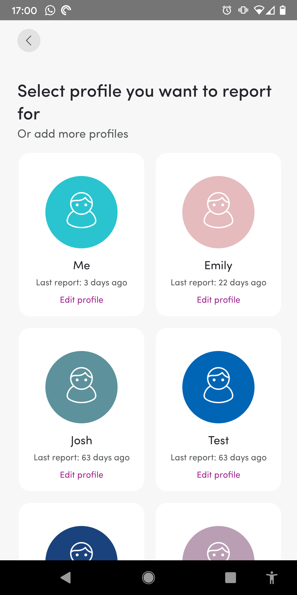
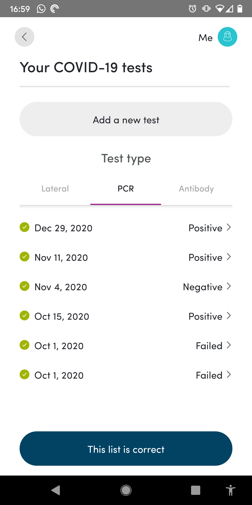
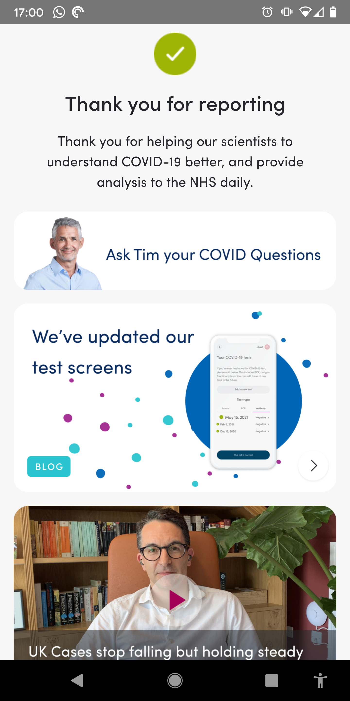

# COVID-19 Symptom Study

[](https://coveralls.io/github/zoe/covid-tracker-react-native?branch=selvach/coverage)

## Table of Contents

- [About The Project](#about-the-project)
- [Getting Started](#getting-started)
  - [Prerequisites](#prerequisites)
  - [Installation](#installation)
  - [Tests](#tests)
- [Roadmap](#roadmap)
- [Contributing](#contributing)
- [Common Issues](#common-issues)
- [License](#license)
- [Contact](#contact)
- [Acknowledgements](#acknowledgements)

## About The Project

<p float="left" align="middle">
  
  
  
  
  
</p>

The ZOE COVID Study is an open source Android and iOS app whose goal is to stop the spread of COVID-19 disease and help identify people who are at risk sooner. 

The App is available in the UK, US and Sweden on the [Apple App Store](https://apps.apple.com/gb/app/covid-symptom-tracker/id1503529611) and [Google Play Store](https://play.google.com/store/apps/details?id=com.joinzoe.covid_zoe). It was launched in late March, 2020 and has over 4 million contributors. It's available free and works on most smartphones and tablets. To find at more, see https://covid.joinzoe.com. 

The ZOE COVID Study was designed by doctors and scientists at King's College London, Guys and St Thomas’ Hospitals working in partnership with ZOE Global Ltd – a health science company.

If you're doing research on COVID-19 and you want to contribute or believe this initiative can help your efforts, please let us know at research@joinzoe.com

### Built With

- [React Native](https://reactnative.dev)
- [Expo](https://expo.io)

## Getting Started

These instructions will get you a copy of the project up and running on your local machine for development and testing purposes.

### Prerequisites

- yarn
- cocopods


```sh
# Install node.js / npm
https://nodejs.org/en/

# Install Homebrew
https://brew.sh/ 

# Yarn
npm install --global yarn

# Ruby
brew install ruby
sudo gem update --system
brew cleanup -d -v

# Cocopods (1.10.1)
brew install cocoapods
brew link --overwrite cocoapods

sudo xcode-select --switch /Applications/Xcode.app
```

### Installation

```sh
# Clone the repo
git clone git@github.com:zoe/covid-tracker-react-native.git

# cd into the project root
cd ./covid-tracker-react-native

# Setup .env file variables
echo "NAME='Staging'" >> .env
echo "API_URL=http://<YOUR_LOCAL_IP_ADDRESS OR TUNNEL>:3000 " >> .env
echo "AMPLITUDE_KEY=test_key" >> .env

# Setup an empty google-services.json
echo "{}" > google-services.json
```

### Running the project


```sh
# Start the mock server. The address of the mock-server should be added as API_URL in the .env file.
# The iOS Simulator won't work with the value http://localhost:3000
# You must use your local IP address or use a tunnel like ngrok  
yarn mock-server

## In a new terminal build and run the project
yarn install
yarn ios
```


### Tests

1. Run the standard suite of integration tests

```bash
yarn test
```

2. Run the Detox E2E tests (iOS only as of April 2021) 

[Set up Detox] (https://github.com/wix/Detox/blob/master/docs/Introduction.GettingStarted.md) (Pay attention to the iOS dependencies!)
   
Build a binary with Detox - this will be used by the test suite to conduct your tests:
```bash
detox build
```

Then run the tests:
```bash
detox test
```

### Style guide

Please refer to the [contributing guidelines](CONTRIBUTING.md).


## Storybook

We are trying to embrace Component Driven Design. To develop

1. Set `ENABLE_STORYBOOK=true` in `App.tsx`

1. Start the storybook server with `npm run storybook`. This will open a webpage where you can flip through the stories in this project, after you've connected a iOS or Android device via `expo start`.


## Git usage

For working with git we follow the Gitflow Workflow, to read all about it see the following explanation: [https://www.atlassian.com/git/tutorials/comparing-workflows/gitflow-workflow](https://www.atlassian.com/git/tutorials/comparing-workflows/gitflow-workflow)

To summarise it:

- The **main** and **develop** branches are protected. It is not possible to directly commit to them.
- Developing is done on **feature** branches which are branched from develop and merged into develop through pull requests. Naming of these branches: feature/(short description of the feature)
- Bugfixes are done on **bugfix** branches which are branched from main and merged into main through pull requests. Naming of these branches: bugfix/(short description of the bugfix)

### Pull Requests

It is expected of the initiator of the PR to merge it themself after a reviewer approved it.

Our PR merging strategy is to squash the branch into develop and then fast-forward develop into master for a release.

## Contributing

Contributions are what make the open source community such an amazing place to learn, inspire, and create. Any contributions you make are **greatly appreciated** - see the [contributing guidelines](CONTRIBUTING.md).

1. Fork the Project
2. Create your Feature Branch (`git checkout -b feature/amazing-feature`)
3. Commit your Changes (`git commit -m 'Add some AmazingFeature'`)
4. Push to the Branch (`git push origin feature/amazing-feature`)
5. Open a Pull Request


## Multiple iOS simulators

[How to run multiple ios simulators with expo](https://stackoverflow.com/questions/53924934/can-i-run-my-expo-app-on-multiple-ios-simulators-at-once)

## License

Distributed under the Apache 2.0 License. See `LICENSE` for more information.

## Contact

ZOE Engineering - engineering@joinzoe.com

## Acknowledgements

- [Contributor Covenant](https://www.contributor-covenant.org)
